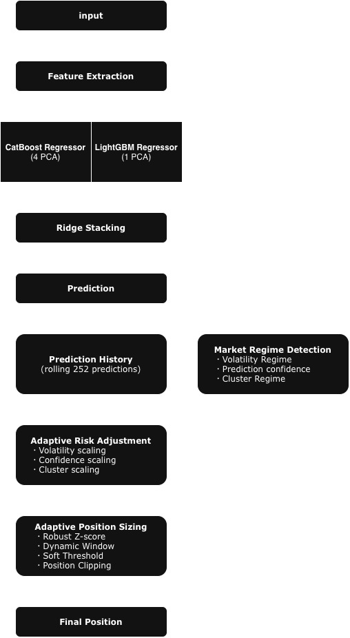

# Hull Tactical - Market Prediction
🥈 Silver Medal Solution  
Ranked 174th out of 3,677 teams in the Kaggle Hull Tactical Market Prediction competition.  


*The current username is **Water Baby**.  

## Overview
This repository contains my solution for the **Kaggle Hull Tactical Market Prediction competition**.  
The task of this competition is to predict the stock market returns as represented by the excess returns of the S&P 500 using a tailored set of market data features while also managing volatility constraints.  
Inference was performed through a server gateway under strict latency constraints.  
*Competition page:* https://www.kaggle.com/competitions/hull-tactical-market-prediction

This repository presents an end-to-end quantitative trading pipeline, covering feature engineering, ensemble learning, market regime detection, and adaptive position sizing.  
Rather than treating forecasting as the final objective, this solution separates prediction from execution by combining an ensemble forecasting engine with adaptive position sizing. 

## Architecture
  

The solution is organized into two major components:

1. Forecast Engine
   - Feature engineering
   - Model ensemble (CatBoost + LightGBM)
   - Ridge stacking

2. Execution Engine
   - Market regime detection
   - Adaptive risk adjustment
   - Dynamic position sizing

## Key Highlights
- Adaptive position sizing
- Market regime detection
- Ridge stacking (CatBoost × LightGBM)
- Stateful inference pipeline
- Time-series feature engineering

## Feature Engineering
Implemented several time-series and market-aware features:

- Lag features
- Rolling statistics
- Momentum
- Market regime features
- Rank-transformed anonymous features
- PCA-compressed latent factors
- Seasonal features

All preprocessing was encapsulated in a reusable scikit-learn Pipeline.

## Modeling
Ensemble Models:

- CatBoost (4 PCA variants)
- LightGBM (1 PCA variant)
- Ridge stacking

Validation:

- Time Series Cross Validation

Deployment:

- Kaggle Inference Server

## Lessons Learned

This competition taught me that model performance alone is not sufficient for production-grade machine learning.

I learned how to:

- Build reproducible ML pipelines
- Prevent time-series leakage
- Design features for online inference
- Separate forecasting from execution
- Transform model predictions into adaptive trading positions
- Optimize latency-aware inference pipelines

I realized that generating accurate predictions is only one part of a trading system.  
Equally important is transforming predictions into robust portfolio positions.  

## Repository Structure

```
Hull_Tactical/
│── images/
│   ├── 174th.png
│   └── Architecture.png
│
│── notebooks/
│   ├── inference.ipynb
│   └── train.ipynb
│
│── src/
│   ├── inference.py
│   └── train.py
│
│── .gitignore
│── LICENSE
│── README.md
└── requirements.txt
```

## Environment Setup

This project is fully localized and optimized to run stably on macOS, including Apple Silicon (M1/M2/M3) environments, without encountering common compilation issues.

### Create a Virtual Environment
To avoid dependency conflicts, it is highly recommended to use `conda` to set up an isolated environment:

```bash
# Create and activate a Python 3.10 environment
conda create -n hull python=3.10 -y
conda activate hull

### Installation
```bash
pip install -r requirements.txt
```
